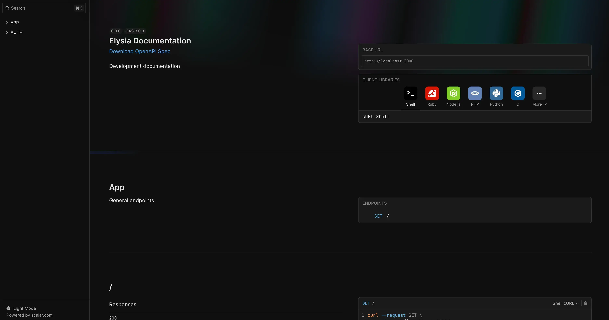
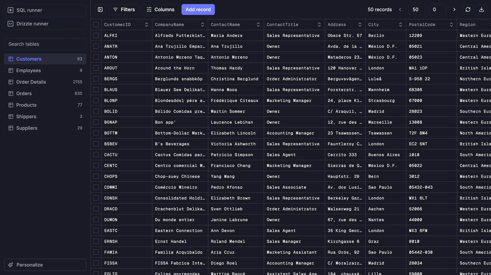

# elysia-template

## Tech Stack

- Bun
- Elysia
- Drizzle ORM
- SQLite
- Typescript

## Setup

Install dependencies

```
bun i
```

Sync prisma schema with db

```
bun run drizzle:push
```

## tools

- Development environment usage swagger.Open /swagger

    ```bash
    bun run start
    ```
    

- Drizzle Studio is a new way for you to explore SQL database.
    
    ```bash
    bun run studio
    ```
    

